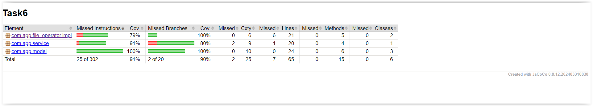

# Simple design to manage files according to the degree of access.

The project implements a text file management system with three main classes: User, Data, and Data Processing. The system allows users (both administrators and regular users) to interact with text files to varying degrees, depending on their permissions.

The project enables the management of text files by system users. Administrators have full permissions to modify the contents of files, while ordinary users can only read data and count occurrences of given patterns. Finally, the modified file contents are saved.

## Technologies and libraries used

* Java
* Maven
* Lombok
* JUnit
* AssertJ
* Slf4j
* Log4j

## Jacoco Coverage

## Required files

* Users file with pattern:

  password1;username1;role1;id1
  password2;username2;role2;id2

* Data with pattern:

  any text